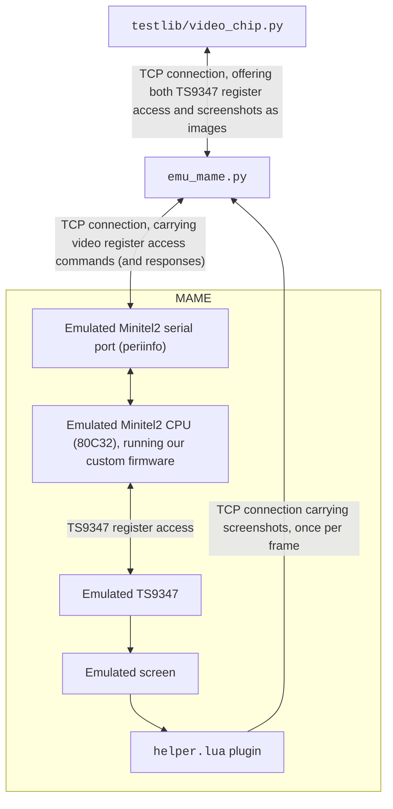

# MAME video chip implementation

This folder contains all the glue code necessary to run the test suite on
[MAME](https://www.mamedev.org/)'s emulated TS9347 video chip.

The entry point is the `emu_mame.py` script, which starts MAME and exposes
the emulated video chip over TCP, exposing the protocol expected by the tests
(whose client code is in `testlib/video_chip.py`).

In order to expose raw access to the video chip, `emu_mame.py` launches the
`minitel2` MAME machine with a custom firmware (running in place of the original
Minitel 2 ROM), that proxies the video chip registers over the serial port.
In addition, `emu_mame.py` also injects the `helper.lua` MAME plugin that
streams screen snapshots back to `emu_mame.py` at every frame.

The following figure describes the architecture:



## Running the test suite on MAME

Install the prerequisites:

```shell
$ sudo apt install build-essential mame python3-pil sdcc
```

Download the `charset.rom` file:

```
CRC:  b2f49eb3
SHA1: d0ef530be33bfc296314e7152302d95fdf9520fc
```

Build our custom firmware for the emulated CPU:

```shell
$ make -C firmware/ all
```

Launch `emu_mame.py`:

```shell
# Leave this running in the background (terminate with CTRL-C):
$ python3 emu_mame.py --listen 127.0.0.1:1234 --mame /usr/games/mame --charset-rom path/to/charset.rom
```

*Note*: In the above command `/usr/games/mame` is the `mame` executable. It can
be replaced with the path to a locally-compiled `mame` executable, if desired.

*Note 2*: It is normal and expected that MAME will print `minitel2_bv4.bin WRONG LENGTH` and
`WRONG CHECKSUMS`, due to the fact that we load a custom firmware.

Lastly, run a test (e.g. `test_resolutions.py`) while `emu_mame.py` is running:

```shell
$ cd ../tests
$ python3 test_resolutions.py --video-chip 127.0.0.1:1234
```
