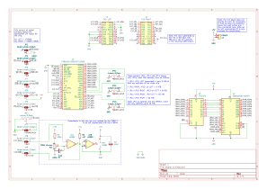

# Hardware board: USB EF9345/TS9347 Video Adapter

This folder contains the schematics, firmware and host software for running the
test suite against real EF9345 and TS9347 chips.

## Board description

The board hosts the video chip (either EF9345P or TS9347CP/2R00), a 32 KiB RAM
module for it to store the text buffers and a 74LS373N latch to demultiplex RAM
addresses. In addition, for the TS9347CP only, an LM393 and some passives
extract the video composite sync signal from the TS9347CP's analog Y output.

The solder jumper pads (JP1 to JP9) on the back side of the board adapt some
internal connections to the connected video chip (the EF9345P and TS9347CP/2R00
are not pin compatible).

Jumpers JP11-JP14 make it possible to limit the available RAM size.

Bill of materials with links:

* U1: The video chip
  ([EF9345P](https://www.aliexpress.com/item/32905550985.html) or
  [TS9347CP/2R00](https://www.ebay.com/itm/281664411315)) and
  [its socket (40 pin variant)](https://www.aliexpress.com/item/1005006256010892.html).
* U2: [AS6C62256-55PCN](https://www.mouser.com/ProductDetail/913-AS6C62256-55PCN)
  SRAM and [its socket](https://www.mouser.com/ProductDetail/737-ICS-628-T).
* U3: [SN74LS373N](https://www.mouser.com/ProductDetail/595-SN74LS373N) and
  [its socket](https://www.mouser.com/ProductDetail/737-ICS-320-T).
* U4 (for the TS9347 only): LM393 and its socket (e.g. from
  [this kit](https://www.aliexpress.com/item/1005007032661721.html)).
* RV1 (for the TS9347 only): 200 kOhm RM065 potentiometer (e.g. from
  [this kit](https://www.aliexpress.com/item/1005006182414764.html)).
* R1 (for the TS9347 only): 220 kOhm resistor.
* R2 (for the TS9347 only): 4.7 kOhm resistor.
* C1 and C2 (for the TS9347 only): 10 uF electrolitic capacitors.
* 2.54 mm male and female pin headers (e.g. from
  [this kit](https://www.aliexpress.com/item/1005006034877497.html)).

In addition, the board itself needs to be mounted on the
[EZ-USB FX2LP development board](https://www.aliexpress.com/item/1005005100640836.html),
which provides the high-speed USB interface to both read/write the video chip's
registers and, most importantily, streaming the real-time video signal back to
the host computer at 12 MiB/s.

### FX2 pinout

| FX2 pin     | EF9345P pin | TS9347CP/2R00 pin | Description                  |
|-------------|-------------|-------------------|------------------------------|
| **FX2 outputs:**                                                          ||||
| CTL0 (J2.16)| CLK (12)    | CLK (12)          | Video Chip Clock             |
| PA3 (J2.10) | AS (14)     | AS (14)           | Address Strobe (aka ALE)     |
| PA4 (J2.9)  | DS (15)     | DS (15)           | Data Strobe (aka ~RD)        |
| PA5 (J2.8)  | R/~W (16)   | R/~W (16)         | Read/Write (aka ~WR)         |
| PA6 (J2.7)  | ~CS (26)    | ~CS (20)          | Chip Select                  |
| **FX2 inputs:**                                                           ||||
| PB0 (J1.15) | I (10)      | G (10)            | Video Signal Value (digital) |
| PB1 (J1.16) | R (9)       | R (9)             | Video Signal Value (digital) |
| PB2 (J1.17) | G (8)       | B (8)             | Video Signal Value (digital) |
| PB3 (J1.18) | B (7)       | not connected     | Video Signal Value (digital) |
| PB6 (J2.18) |             |                   | CTL0 loopback (for debug)    |
| PB7 (J2.17) | HVS/HS (5)  | Y (7) via LM393   | Video Signal Composite Sync  |
| **Bidirectional:**                                                        ||||
| PD0 (J2.5)  | AD0 (17)    | AD0 (17)          | Multiplexed Address/Data Bus |
| PD1 (J2.4)  | AD1 (18)    | AD1 (18)          | Multiplexed Address/Data Bus |
| PD2 (J2.3)  | AD2 (19)    | AD2 (19)          | Multiplexed Address/Data Bus |
| PD3 (J2.2)  | AD3 (21)    | AD3 (21)          | Multiplexed Address/Data Bus |
| PD4 (J2.1)  | AD4 (22)    | AD4 (22)          | Multiplexed Address/Data Bus |
| PD5 (J1.1)  | AD5 (23)    | AD5 (23)          | Multiplexed Address/Data Bus |
| PD6 (J1.2)  | AD6 (24)    | AD6 (24)          | Multiplexed Address/Data Bus |
| PD7 (J1.3)  | AD7 (25)    | AD7 (25)          | Multiplexed Address/Data Bus |

Note: When EZ-USB's J3 jumper is inserted, PA0 and PA1 control the on-board LEDs
(respectively D1 and D2). Our firmware reports what kind of chip it detected
through these LEDs: EF9345 = D1 on, TS9347 = D2 on, detection failed = both on.

### Schematic

### Getting 5 V power (Vusb) from the FX2 development board

TODO
